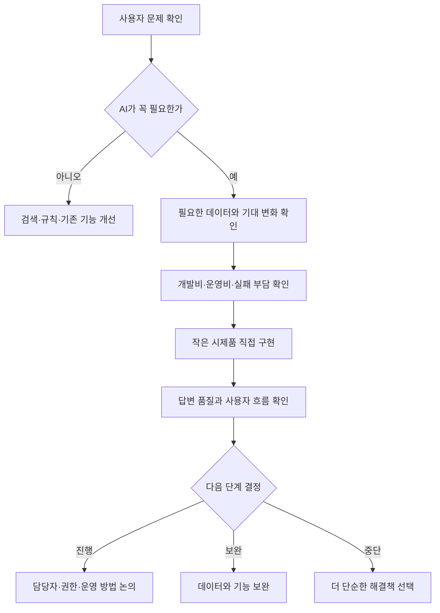

# Enterprise AX — AI 제품 기획과 전사 AX

> 기간: 2025.11–현재(전사 AX 과제는 2026–현재) · 역할: Product Owner · AI Agent Platform Lead
> 확인 자료: 본인 작성 업무 문서(비공개). 현직 사례라 공개 근거 링크는 두지 않음
> 공개 범위: 현직 사례이므로 제품명·내부 지표·로드맵은 제외

## 한 줄 요약

현직에서 AI로 풀 과제를 고르는 기준을 세우고, 검토용 시제품을 직접 만들어 제품팀의 다음 단계 논의를 도왔습니다.

## 문제

AI 아이디어는 많았지만, 데모를 만드는 것만으로는 제품이 되지 않았습니다. 일을 시작하기 전에 다음 질문부터 확인했습니다.

- AI가 꼭 필요한가, 검색이나 기존 기능으로 풀 수 있는가
- 사용자의 시간과 경험이 어떻게 달라져야 하는가
- 어떤 데이터와 외부 도구가 필요한가
- 개발비와 운영비를 감당할 수 있는가
- 답변이 틀리거나 막히면 누가 다시 확인할 것인가

## 주요 업무

- 서비스와 업무 현장에서 나온 AI 아이디어를 모으고 사용자 문제와 기대 변화를 정리
- 검색, 규칙, 기존 기능으로 더 잘 풀 수 있는 일은 AI 개발 대상에서 제외
- AI가 사용할 데이터와 외부 도구, 답변 순서, 사람의 확인이 필요한 상황을 개발팀과 함께 정리
- 개발비와 운영비, 줄일 수 있는 시간과 실패했을 때의 부담을 비교해 우선순위 판단 자료 작성
- 제품·개발·데이터·운영 담당자와 권한·보안·품질 확인 방법 논의
- AI 코딩 도구로 검토용 시제품과 업무 자동화 도구 직접 구현

## 일을 고르는 순서

> 공개 설명을 위해 새로 작성한 개념도입니다. 실제 회사 시스템 구조·데이터·운영 현황을 복제하지 않습니다.

## 비용과 효과를 보는 방법

모델 사용료만 보지 않았습니다. 현재 업무에 드는 시간과 비용, 만들고 운영하는 비용, 답이 틀렸을 때 사람이 다시 처리할 비용을 함께 봤습니다.

| 판단 요소 | 확인 질문 |
|---|---|
| 현재 기준선 | 지금 걸리는 시간·비용·오류·사람 개입은 무엇인가 |
| 기대효과 | 자동화 시간, 품질, 처리량, 사용자 경험 중 무엇을 개선하는가 |
| 총비용 | 모델·API·라이선스·인프라·연동·평가·운영 비용은 얼마인가 |
| 품질·리스크 | 오답·지연·실패·보안 문제가 사업에 미치는 영향은 무엇인가 |
| 반복 가능성 | 한 번의 데모가 아니라 재사용 가능한 업무 흐름인가 |
| 다음 단계 | 어떤 결과면 진행하고, 보완하거나 중단할 것인가 |

실제 사내 ROI 수치와 제품별 결정은 공개하지 않습니다.

## 주요 성과

- AI 과제를 검토할 때 사용자 문제, 필요한 데이터, 기대 효과와 비용을 함께 확인하는 기준을 만들었습니다.
- 기획 문서만 전달하지 않고 검토용 시제품과 반복 설정을 줄이는 사내 도구를 직접 만들었습니다.
- 실제 제품 성과, ROI 달성액, 사내 도입률, 조직별 평가와 비공개 로드맵은 공개하지 않습니다.

## 공개 경계

| 공개하는 내용 | 공개하지 않는 내용 |
|---|---|
| 맡은 역할과 AI 과제를 고르는 기준 | 사내 제품 목록·내부 제품명 |
| 일반화한 업무 방식 | 현직 업무 결과물(시제품·도구)과 비공개 코드·프롬프트·데이터·API |
| 공개용으로 재구성한 개념도 | 실제 시스템 구조와 보안 구성 |
| 비용·효과를 보는 일반 질문 | 실제 ROI 수치·도입률·경영 의사결정 |
