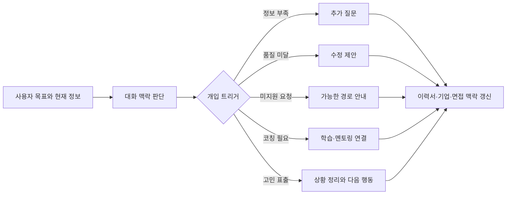

# 대화형 커리어 지원 AI 제품 기획 (원티드랩, 2023–2024)

> 기간: 2023.12–2024 · 역할: Product Owner
> 증거 상태: **I** — 2023년 12월 본인 작성 기획 산출물을 일반화해 재구성. 원문은 비공개
> 결과 상태: 제품 기획 산출물 확인. 출시·실험 성과는 주장하지 않음

## 한 줄 요약

이력서 작성, 기업 탐색, 커리어 상담, 면접 준비로 흩어진 구직자의 의사결정을 하나의 대화형 흐름으로 묶고, AI가 개입해야 하는 상황을 다섯 가지 트리거로 정의했습니다.

## 문제

구직자는 이력서 작성, 산업 정보 확인, 지원 기업 탐색, 면접 준비를 서로 다른 서비스와 문서에서 수행해야 했습니다. 정보가 부족하거나 결과 품질이 낮아도 사용자가 다음에 무엇을 해야 하는지 판단하기 어려웠습니다.

## 주요 업무

- 이력서 분석·산업 트렌드·채용기업 정보·면접 시뮬레이션을 연결한 제품 구조 설계
- 커리어 상담과 역량 개발을 포함한 대화형 사용자 여정 정의
- AI가 질문하거나 사람에게 넘겨야 할 다섯 가지 상황 정의
- 사업 목표를 사용자 획득·유지·지원·성장 관점으로 정리
- 상위 요구사항, User Story, Acceptance Criteria 작성

## 핵심 결정

AI 기능 목록보다 먼저 **언제 개입해야 하는가**를 정의했습니다. 공개용으로 일반화한 개입 조건은 다음과 같습니다.

1. 필요한 정보가 부족한 경우
2. 작성 결과의 품질이 기준에 미치지 못하는 경우
3. 현재 기능이 요청을 지원하지 못하는 경우
4. 추가 코칭이 필요한 경우
5. 사용자가 고민이나 불안을 표현한 경우

각 조건을 별도의 예외로 남기지 않고, 다음 질문·수정 제안·정보 탐색·코칭 연결 같은 후속 행동으로 이어지는 제품 요구사항으로 만들었습니다.

## 공개용 개념도

> 공개 설명을 위해 새로 작성한 개념도입니다. 실제 회사 시스템 구조·데이터·운영 현황을 복제하지 않습니다.

## 주요 성과와 공개 범위

- 2023년 12월 작성한 기획 산출물을 바탕으로 기능 구성과 AI 개입 기준을 일반화해 다시 작성했습니다.
- 이 사례는 대화형 AI 제품의 문제 정의와 요구사항 설계 경험을 보여줍니다.
- 실제 출시 범위, 모델 구성, 사용자 데이터, 실험 지표와 사업 성과는 공개 근거가 없어 포함하지 않습니다.

## 공개 경계

| 공개하는 내용 | 공개하지 않는 내용 |
|---|---|
| 문제, 역할, 기능 축, 개입 판단 방식 | 원문 기획안, 내부 화면, 모델·프롬프트 구조 |
| 2023년 12월 기획 산출물 존재 | 사용자 데이터, 출시 일정, 실험·사업 지표 |
| 공개용으로 재구성한 개념도 | 실제 시스템 아키텍처와 내부 API |
